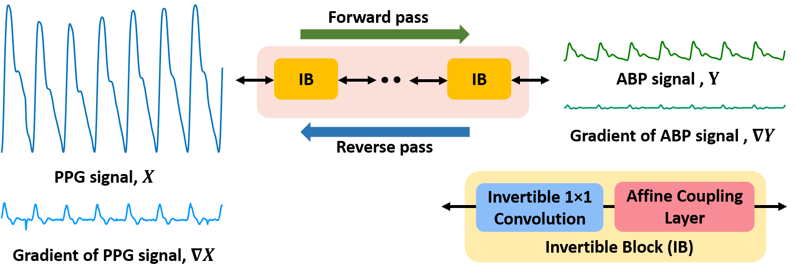

# INN-PAR: Invertible Neural Network for PPG to ABP Reconstruction

[Arxiv](https://arxiv.org/pdf/2409.09021) [Paper](https://ieeexplore.ieee.org/document/10888915)

> **Abstract:** *Non-invasive and continuous blood pressure (BP) monitoring is essential for the early prevention of many cardiovascular diseases. Estimating arterial blood pressure (ABP) from photoplethysmography (PPG) has emerged as a promising solution. However, existing deep learning approaches for PPG-to-ABP reconstruction (PAR) encounter certain information loss, impacting the precision of the reconstructed signal. To overcome this limitation, we introduce an invertible neural network for PPG to ABP reconstruction (INN-PAR), which employs a series of invertible blocks to jointly learn the mapping between PPG and its gradient with the ABP signal and its gradient. INN-PAR efficiently captures both forward and inverse mappings simultaneously, thereby preventing information loss. By integrating signal gradients into the learning process, INN-PAR enhances the network’s ability to capture essential high-frequency details, leading to more accurate signal reconstruction. Moreover, we propose a multi-scale convolution module (MSCM) within the invertible block, enabling the model to learn features across multiple scales effectively. We have experimented on two benchmark datasets, which show that INN-PAR significantly outperforms the state-of-the-art methods in both waveform reconstruction and BP measurement accuracy.* 



## Dependencies
- Python 3.9
- PyTorch 2.0.1
- [NVIDIA GPU + CUDA](https://developer.nvidia.com/cuda-downloads)

## Create environment and install packages
```
conda create -n INNPAR python=3.9
conda activate INNPAR
pip install -r requirements.txt
```

## Contents
1. [Datasets](#Datasets)
2. [Pretrained](#Pretrained)
3. [Training](#Training)
4. [Testing](#Testing)
5. [Citation](#Citation)

## Datasets

Used training and testing sets can be downloaded as follows:

[Trainset](https://drive.google.com/drive/folders/1WbvqdxyuuWYxXIQJPDt0xqVxHJEamOYP?usp=sharing) (Sensors)

[Testset](https://drive.google.com/drive/folders/1pLy740AxFJPHgeyFLEoerLhkuV3r-6fL?usp=sharing) (Sensors, BCG)

Download training and test sets and keep them into the corresponding folders of `datasets/`. See [datasets](datasets/README.md) for the detail of the directory structure.

## Pretrained

Pre-trained network parameters can be downloaded from:

[pretrained](https://drive.google.com/drive/folders/1gI0oj-HaV89BJ__k9BQeAGaUMYmUTKCL?usp=sharing)

Download pretrained weights and keep into the `checkpoints/` folder.

## Training

- Download [trainset](https://drive.google.com/drive/folders/1WbvqdxyuuWYxXIQJPDt0xqVxHJEamOYP?usp=sharing) (Sensors), place in `datasets/` folder.

- Run the following script.

```
python train.py
```

## Testing

- Download the [pretrained](https://drive.google.com/drive/folders/1gI0oj-HaV89BJ__k9BQeAGaUMYmUTKCL?usp=sharing) parameters and place in `checkpoints/` folder.

- Download [testset](https://drive.google.com/drive/folders/1pLy740AxFJPHgeyFLEoerLhkuV3r-6fL?usp=sharing) (Sensors, BCG), place them in `datasets/` folder.

- Run the following script.

```
python test.py
```
## Citation

If you find the code helpful in your research or work, please cite the following paper.

```
@INPROCEEDINGS{10888915,
  author={Kundu, Soumitra and Panda, Gargi and Bhattacharya, Saumik and Routray, Aurobinda and Guha, Rajlakshmi},
  booktitle={ICASSP 2025 - 2025 IEEE International Conference on Acoustics, Speech and Signal Processing (ICASSP)}, 
  title={INN-PAR: Invertible Neural Network for PPG to ABP Reconstruction}, 
  year={2025},
  pages={1-5},
  keywords={Deep learning;Accuracy;Convolution;Prevention and mitigation;Neural networks;Photoplethysmography;Signal reconstruction;Physiology;Speech processing;Monitoring;PPG;ABP;waveform reconstruction;invertible neural network},
  doi={10.1109/ICASSP49660.2025.10888915}}

```
